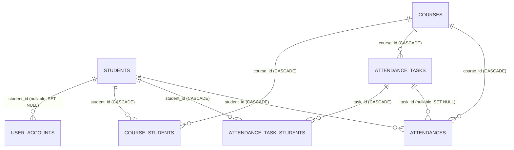

# 数据库关系（sql_app.db）

本文用于从当前代码与实际约束中提取数据库的实体关系，便于绘制 ER 图与撰写说明。数据库为 SQLite，默认文件为仓库根目录的 `sql_app.db`（见 [database.py](file:///c:/Users/15080/Desktop/systems/core/database.py)）。

数据模型主要来源于 [models.py](file:///c:/Users/15080/Desktop/systems/core/models.py)（SQLAlchemy ORM），并由 [app.py 的 ensure_schema()](file:///c:/Users/15080/Desktop/systems/web/app.py#L180-L610) 负责在启动时对关键表进行建表/重建与外键修复。

## 关系总览（Mermaid ER）

> 说明：`ADMIN_USERS`、`AUDIT_LOGS` 不依赖其他表（无外键），因此不出现在上图的连线里。

## 表级说明

### students（学生）

- 主键：`student_id`
- 唯一约束：`student_no`（唯一）
- 关键字段：
  - `face_image_path`：注册的原始人脸图片路径（可能是加密的 `.enc` 文件）
  - `face_embedding_enc`：人脸特征向量（加密后的 base64 文本）
  - `face_embedding_model_sig`：`face_embedding_enc` 对应的识别模型签名（用于模型热切换后判定是否需要重建特征）
- 被引用：
  - `user_accounts.student_id`（可空，`ON DELETE SET NULL`）
  - `course_students.student_id`（必填，`ON DELETE CASCADE`）
  - `attendance_task_students.student_id`（必填，`ON DELETE CASCADE`）
  - `attendances.student_id`（必填，`ON DELETE CASCADE`）

### user_accounts（账号）

- 主键：`id`
- 唯一约束：`username`（唯一）
- 外键：
  - `student_id -> students.student_id`（可空，`ON DELETE SET NULL`）
- 含义：系统登录账号，与学生可关联也可不关联（如管理员/教师账号）。

### courses（课程）

- 主键：`course_id`
- 唯一约束：`course_no`（唯一）
- 被引用：
  - `course_students.course_id`（必填，`ON DELETE CASCADE`）
  - `attendance_tasks.course_id`（必填，`ON DELETE CASCADE`）
  - `attendances.course_id`（必填，`ON DELETE CASCADE`）

### course_students（课程-学生关系，选课/名单关联表）

- 主键：`id`
- 外键：
  - `course_id -> courses.course_id`（必填，`ON DELETE CASCADE`）
  - `student_id -> students.student_id`（必填，`ON DELETE CASCADE`）
- 含义：课程与学生的多对多关系（一个课程多个学生，一个学生多个课程）。

### attendance_tasks（考勤任务）

- 主键：`task_id`
- 外键：
  - `course_id -> courses.course_id`（必填，`ON DELETE CASCADE`）
- 被引用：
  - `attendance_task_students.task_id`（必填，`ON DELETE CASCADE`）
  - `attendances.task_id`（可空，`ON DELETE SET NULL`）
- 含义：一次考勤活动（属于某门课程）。

### attendance_task_students（考勤任务-学生关联表）

- 主键：`id`
- 外键：
  - `task_id -> attendance_tasks.task_id`（必填，`ON DELETE CASCADE`）
  - `student_id -> students.student_id`（必填，`ON DELETE CASCADE`）
- 含义：一次考勤任务的参与名单。

### attendances（考勤记录）

- 主键：`record_id`
- 外键：
  - `student_id -> students.student_id`（必填，`ON DELETE CASCADE`）
  - `course_id -> courses.course_id`（必填，`ON DELETE CASCADE`）
  - `task_id -> attendance_tasks.task_id`（可空，`ON DELETE SET NULL`）
- 含义：实际签到/识别的结果明细；可绑定到某次 `attendance_tasks`，也可为空（如无任务模式）。

### admin_users（历史管理员表）

- 主键：`id`
- 外键：无
- 含义：兼容旧版本遗留的管理员账号表（与 `user_accounts` 并存）。

### audit_logs（审计日志）

- 主键：`id`
- 外键：无
- 含义：记录关键操作（如创建/删除/更新、设置变更等）的审计信息。

## 字段明细（Markdown 表格）

> 字段来源以 ORM 为准（[models.py](file:///c:/Users/15080/Desktop/systems/core/models.py)）。SQLite 实际建表/重建逻辑见 [ensure_schema()](file:///c:/Users/15080/Desktop/systems/web/app.py#L180-L610)。

### students

| 字段 | 类型 | 允许空 | 主键 | 唯一 | 外键 | 默认/说明 |
|---|---|---:|---:|---:|---|---|
| student_id | INTEGER | 否 | 是 | 否 | - | 自增 |
| student_no | VARCHAR | 否 | 否 | 是 | - | 学号 |
| name | VARCHAR | 否 | 否 | 否 | - | 姓名 |
| class_name | VARCHAR | 是 | 否 | 否 | - | 班级 |
| college | VARCHAR | 是 | 否 | 否 | - | 学院 |
| gender | VARCHAR | 是 | 否 | 否 | - | 性别 |
| face_image_path | VARCHAR | 是 | 否 | 否 | - | 人脸原始图像路径（可能为 `.enc`） |
| face_embedding_enc | TEXT | 是 | 否 | 否 | - | embedding（加密 base64） |
| face_embedding_model_sig | VARCHAR | 是 | 否 | 否 | - | embedding 对应模型签名 |
| created_at | DATETIME | 是 | 否 | 否 | - | 默认 `datetime.now` |

### user_accounts

| 字段 | 类型 | 允许空 | 主键 | 唯一 | 外键 | 默认/说明 |
|---|---|---:|---:|---:|---|---|
| id | INTEGER | 否 | 是 | 否 | - | 自增 |
| username | VARCHAR | 否 | 否 | 是 | - | 登录用户名 |
| hashed_password | VARCHAR | 是 | 否 | 否 | - | 密码哈希 |
| role | VARCHAR | 否 | 否 | 否 | - | `admin \| teacher \| student` |
| full_name | VARCHAR | 是 | 否 | 否 | - | 姓名/显示名 |
| student_id | INTEGER | 是 | 否 | 否 | students(student_id) ON DELETE SET NULL | 账号可绑定学生 |
| created_at | DATETIME | 是 | 否 | 否 | - | 默认 `datetime.now` |

### admin_users

| 字段 | 类型 | 允许空 | 主键 | 唯一 | 外键 | 默认/说明 |
|---|---|---:|---:|---:|---|---|
| id | INTEGER | 否 | 是 | 否 | - | 自增 |
| username | VARCHAR | 否 | 否 | 是 | - | 历史管理员用户名 |
| hashed_password | VARCHAR | 否 | 否 | 否 | - | 密码哈希 |
| full_name | VARCHAR | 是 | 否 | 否 | - | 姓名/显示名 |
| created_at | DATETIME | 是 | 否 | 否 | - | 默认 `datetime.now` |

### courses

| 字段 | 类型 | 允许空 | 主键 | 唯一 | 外键 | 默认/说明 |
|---|---|---:|---:|---:|---|---|
| course_id | INTEGER | 否 | 是 | 否 | - | 自增 |
| course_no | VARCHAR | 否 | 否 | 是 | - | 课程编号 |
| course_name | VARCHAR | 否 | 否 | 否 | - | 课程名称 |
| teacher | VARCHAR | 是 | 否 | 否 | - | 授课老师 |
| schedule | VARCHAR | 是 | 否 | 否 | - | 课程安排描述 |
| start_time | DATETIME | 是 | 否 | 否 | - | 开始时间 |
| end_time | DATETIME | 是 | 否 | 否 | - | 结束时间 |
| location | VARCHAR | 是 | 否 | 否 | - | 上课地点 |
| class_names | VARCHAR | 是 | 否 | 否 | - | 适用班级（逗号分隔） |
| created_at | DATETIME | 是 | 否 | 否 | - | 默认 `datetime.now` |

### course_students

| 字段 | 类型 | 允许空 | 主键 | 唯一 | 外键 | 默认/说明 |
|---|---|---:|---:|---:|---|---|
| id | INTEGER | 否 | 是 | 否 | - | 自增 |
| course_id | INTEGER | 否 | 否 | 否 | courses(course_id) ON DELETE CASCADE | 课程 |
| student_id | INTEGER | 否 | 否 | 否 | students(student_id) ON DELETE CASCADE | 学生 |
| created_at | DATETIME | 是 | 否 | 否 | - | 默认 `datetime.now` |

### attendance_tasks

| 字段 | 类型 | 允许空 | 主键 | 唯一 | 外键 | 默认/说明 |
|---|---|---:|---:|---:|---|---|
| task_id | INTEGER | 否 | 是 | 否 | - | 自增 |
| title | VARCHAR | 否 | 否 | 否 | - | 任务标题 |
| course_id | INTEGER | 否 | 否 | 否 | courses(course_id) ON DELETE CASCADE | 所属课程 |
| class_name | VARCHAR | 是 | 否 | 否 | - | 班级（可选） |
| status | VARCHAR | 否 | 否 | 否 | - | 任务状态（业务字段） |
| start_time | DATETIME | 是 | 否 | 否 | - | 开始时间 |
| end_time | DATETIME | 是 | 否 | 否 | - | 结束时间 |
| created_by | VARCHAR | 是 | 否 | 否 | - | 创建人（用户名等） |
| created_at | DATETIME | 是 | 否 | 否 | - | 默认 `datetime.now` |

### attendance_task_students

| 字段 | 类型 | 允许空 | 主键 | 唯一 | 外键 | 默认/说明 |
|---|---|---:|---:|---:|---|---|
| id | INTEGER | 否 | 是 | 否 | - | 自增 |
| task_id | INTEGER | 否 | 否 | 否 | attendance_tasks(task_id) ON DELETE CASCADE | 考勤任务 |
| student_id | INTEGER | 否 | 否 | 否 | students(student_id) ON DELETE CASCADE | 学生 |
| created_at | DATETIME | 是 | 否 | 否 | - | 默认 `datetime.now` |

### attendances

| 字段 | 类型 | 允许空 | 主键 | 唯一 | 外键 | 默认/说明 |
|---|---|---:|---:|---:|---|---|
| record_id | INTEGER | 否 | 是 | 否 | - | 自增 |
| student_id | INTEGER | 否 | 否 | 否 | students(student_id) ON DELETE CASCADE | 学生 |
| course_id | INTEGER | 否 | 否 | 否 | courses(course_id) ON DELETE CASCADE | 课程 |
| task_id | INTEGER | 是 | 否 | 否 | attendance_tasks(task_id) ON DELETE SET NULL | 可不绑定任务 |
| check_time | DATETIME | 是 | 否 | 否 | - | 默认 `datetime.now` |
| confidence | FLOAT | 是 | 否 | 否 | - | 置信度（可选） |
| status | VARCHAR | 是 | 否 | 否 | - | 默认 `Present`（业务字段） |
| created_at | DATETIME | 是 | 否 | 否 | - | 默认 `datetime.now` |

### audit_logs

| 字段 | 类型 | 允许空 | 主键 | 唯一 | 外键 | 默认/说明 |
|---|---|---:|---:|---:|---|---|
| id | INTEGER | 否 | 是 | 否 | - | 自增 |
| actor_username | VARCHAR | 是 | 否 | 否 | - | 操作人用户名 |
| actor_role | VARCHAR | 是 | 否 | 否 | - | 操作人角色 |
| action | VARCHAR | 否 | 否 | 否 | - | 动作类型 |
| resource | VARCHAR | 是 | 否 | 否 | - | 资源/接口 |
| status | VARCHAR | 是 | 否 | 否 | - | 操作结果 |
| ip | VARCHAR | 是 | 否 | 否 | - | 来源 IP |
| user_agent | VARCHAR | 是 | 否 | 否 | - | UA |
| details | TEXT | 是 | 否 | 否 | - | 详情（文本/JSON） |
| created_at | DATETIME | 是 | 否 | 否 | - | 默认 `datetime.now` |

## 典型基数（Cardinality）

- `students` 1 —— N `user_accounts`（学生可能关联 0 或 1 个账号；但数据库约束层面允许多个账号指向同一个学生，需要业务层保证唯一性）
- `courses` N —— N `students`（通过 `course_students`）
- `attendance_tasks` N —— 1 `courses`
- `attendance_tasks` N —— N `students`（通过 `attendance_task_students`）
- `attendances` N —— 1 `students`
- `attendances` N —— 1 `courses`
- `attendances` N —— 0..1 `attendance_tasks`

## 画图建议

- 画 ER 图时建议将 `course_students`、`attendance_task_students` 作为“关联表（junction table）”单独画出，并标注两侧外键与 `ON DELETE` 行为。
- 若要强调“模型热切换能力”，可以在 `students` 表旁额外标注：
  - `face_image_path` 是“原始图像来源”
  - `face_embedding_enc + face_embedding_model_sig` 是“可重建的派生数据（derived/cache）”
